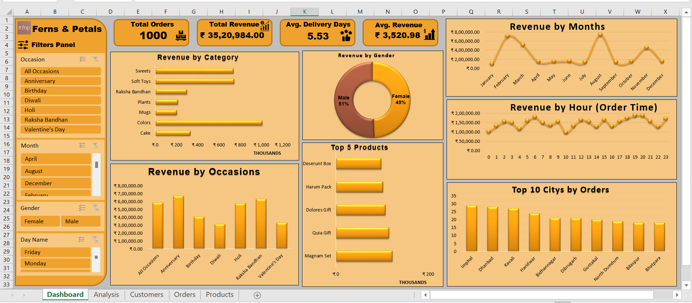

# 🌸 Ferns & Petals Sales Analysis (Excel Project)

A complete **end-to-end sales analysis project** following a real **industry-level data analytics workflow** — from **data extraction and cleaning** to **data modeling, analysis, reporting, and dashboard creation** using **Microsoft Excel**.

     

---

## 🧩 Business Problem

Ferns & Petals is a popular gifting brand offering products such as cakes, flowers, plants, and personalized gifts. Despite its wide presence, the company faces several key challenges related to sales performance, customer behavior, and operational efficiency.

### 🔻 Key Challenges

* Unclear sales trends across months, cities, and product categories
* No clear visibility of top-performing products and occasions
* Delivery time fluctuations affecting customer satisfaction
* Inconsistent revenue across festivals and special occasions
* Limited understanding of gender-wise and city-wise customer behavior
* Lack of actionable insights from raw transactional data

### 📌 Why This Analysis Was Needed

The company aims to answer critical questions such as:

* Which **product categories** drive the most revenue?
* Which **cities** are performing well or underperforming?
* How do **customer demographics** impact purchase behavior?
* What **occasions** generate peak sales?
* Where can **delivery operations** be improved?

### 🎯 Business Goal

Transform raw sales data into meaningful insights to help the company:

* Improve marketing and promotional strategies
* Optimize delivery operations
* Identify and focus on high-performing products
* Understand customer buying trends
* **Boost overall sales performance**

---

## 📁 Project Structure

```
│
├── 📘 README.md 
│
├── 📁 data/
│       ├── customers.csv
│       ├── products.csv
│       └── orders.csv
│
├── 📄 Docs/ 
│       ├──  Problem Statement.pdf
│       └──  Ferns & Petals Sales Analysis Report.pdf
│
├── 📊 Excel-Analysis/
│       └──  Ferns_and_Petals_Sales_Analysis.xlsx
│
└── 🖼️ Images/
        └──  dashboard_image.png
```

---

## 📘 Project Overview

The **Ferns & Petals Sales Analysis** project analyzes sales performance across **products, categories, cities, occasions, customers, and time periods**.

This project replicates a **real-world BI workflow** used by companies for sales monitoring and decision-making.

This project demonstrates skills in:

- **ETL using Power Query**
- **Data Modeling using Power Pivot**
- **Pivot Table–based exploration**
- **Interactive Dashboard Design**
- **Business Insights & Reporting**

📄 **Included in this repository:**
- **Ferns & Petals Sales Analysis Report.pdf**
- **Problem Statement.pdf**
- **Interactive Excel Dashboard**
- **Raw dataset (Customers, Orders, Products)**

---

## 🎯 Objective

To analyze the sales performance of **Ferns & Petals** and uncover:

- Revenue patterns across **occasions, locations, and categories**
- Customer buying behavior & segmentation
- Most profitable product categories
- Delivery trends & order frequency patterns
- Key areas for business improvement

---

## 🧩 Project Workflow (6-Step BI Process)

### **1️⃣ Data Extraction**
Imported 3 raw CSV files using **Power Query**:
- `customers.csv`
- `orders.csv`
- `products.csv`

### **2️⃣ Data Cleaning & Transformation (ETL)**
Performed using **Power Query**:
- Removed duplicates & blanks  
- Cleaned and standardized date/time formats  
- Added calculated columns:  
  - `Delivery Days`  
  - `Revenue`  
  - `Profit Margin`  
- Ensured consistent data types  
- Cleaned categorical fields (Occasion, Category, City)

### **3️⃣ Data Modeling (Power Pivot)**
Created a **Star Schema**:
- **Fact Table:** Orders  
- **Dimension Tables:** Customers, Products  
- Relationships using `Customer_ID` & `Product_ID`

### **4️⃣ Data Analysis**
Using Pivot Tables & DAX:
- Total Revenue & Total Orders  
- Avg. Delivery Days  
- Avg. Revenue per Order  
- Category-wise sales  
- Occasion-wise performance  
- City & Gender-wise insights  

### **5️⃣ Dashboard Creation**
Built an interactive dashboard with:
- KPIs  
- Dynamic charts  
- Filters (Slicers)  
- Category & Occasion rankings  
- City-wise performance insights  

### **6️⃣ Insights & Reporting**
A professional **PDF report** summarizing:
- Business problem  
- Key insights  
- Sales trends  
- Recommendations  

---

## 📊 Dashboard Overview



---

## 📈 Key Metrics Summary

| Metric | Value |
|--------|--------|
| **Total Orders** | 15 |
| **Unique Customers** | 99 |
| **Unique Products** | 15 |
| **Total Revenue** | ₹17,691 |
| **Average Revenue per Order** | ₹1,179 |
| **Average Delivery Days** | ~6.2 days |

---

## 💡 Key Insights

### 🏆 Top Cities by Revenue
- Rajkot  
- Bilaspur  
- Jaipur  
- Bardhaman  
- Ambala  

### 🛍️ Top Categories by Revenue
- Colors  
- Sweets  
- Cake  
- Plants  
- Mugs  

### 🎉 Occasion-wise Insights
1. **Diwali** – Highest revenue  
2. **Anniversary** – Consistent demand  
3. **Birthday** – High order volume  
4. **Valentine’s Day** – Seasonal spike  
5. **Holi** – Moderate revenue  

### 👥 Gender Insights
- **Female customers** generated slightly higher revenue  
- **Male customers** placed more orders but had lower AOV  

---

## 🔍 Deep-Dive Observations

- 🎨 **Colors** category dominates revenue  
- 🚚 Avg. delivery time ~6.2 days → improvement area  
- 🎁 Festival seasons (Diwali, Raksha Bandhan) create high spikes  
- ⏰ Most orders placed in evening hours  
- 📅 High sales during **February, July & September**  

---

## 🛠 Tools & Technologies Used

| Tool | Purpose |
|------|----------|
| **Microsoft Excel** | Analysis & Dashboard |
| **Power Query** | Data Cleaning & ETL |
| **Power Pivot** | Data Modeling |
| **Pivot Tables & DAX** | Calculations & KPIs |
| **Excel Charts** | Visualization |

---

## 🗂 Dataset Information

| File | Description | Key Columns |
|------|-------------|--------------|
| `customers.csv` | Customer details | Customer_ID, Name, City, Gender |
| `products.csv` | Product catalog | Product_ID, Category, Price |
| `orders.csv` | Order transactions | Order_ID, Customer_ID, Product_ID, Quantity, Order_Date, Delivery_Date |

---

## 🏁 Conclusion

This project demonstrates **real-world business intelligence skills using Excel**, including:

- End-to-end **ETL pipeline**
- **Data modeling** with relationships  
- **Pivot Table & DAX-based analysis**
- **Interactive Dashboard creation**  
- Turning raw data into **meaningful business insights**  

It reflects how retail companies track performance and optimize sales & marketing decisions.

---

## 🧠 Learning Outcomes

- Power Query → **Professional data cleaning**  
- Power Pivot → **Star schema modeling**  
- DAX → **Business metric calculations**  
- Dashboard → **Visual storytelling**  
- Insight writing → **Business communication**  

---

## 🚀 Business Impact
This analysis helps Ferns & Petals:

- Identify profitable categories (Colors, Cakes, Plants)
- Plan inventory for high-demand festivals (Diwali, Raksha Bandhan)
- Improve delivery operations (reduce 6.2-day avg delivery time)
- Personalize marketing based on gender & city insights

---

## 🧰 Skills Demonstrated
- ETL Pipeline  
- Data Cleaning  
- Data Modeling  
- Pivot Tables  
- DAX Measures  
- Dashboard Design  
- Retail Analytics  
- Business Insights  

---

## 🧑‍💻 Author

**👤 Harsh Belekar**  
📍 Data Analyst | Python | SQL | Power BI | Excel | Data Visualization  
📬 [LinkedIn](https://www.linkedin.com/in/harshbelekar) | 🔗[GitHub](https://github.com/Harsh-Belekar)

📧 [harshbelekar74@gmail.com](mailto:harshbelekar74@gmail.com)

---

⭐ *If you found this project helpful, feel free to star the repo and connect with me for collaboration!*
